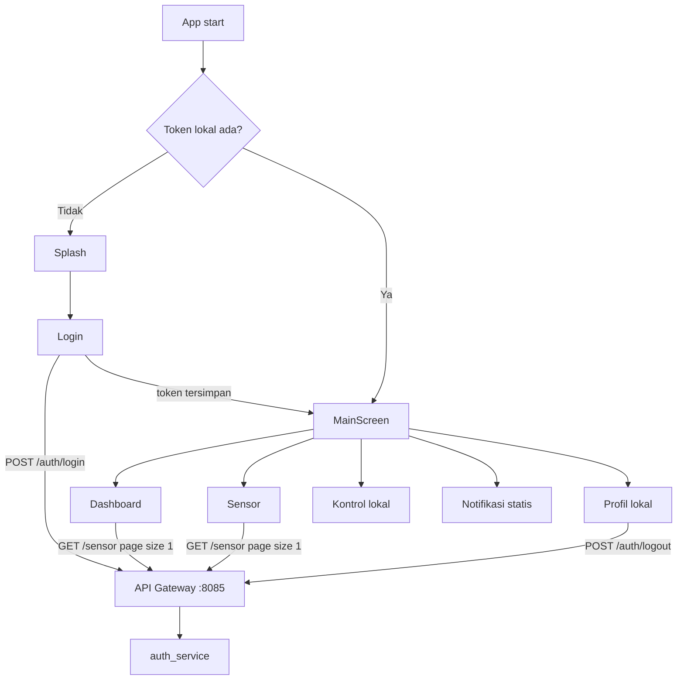

# Flutter Project Overview

Tanggal audit: 2026-06-17

## Ringkasan Aplikasi

ATMA Flutter adalah aplikasi Android untuk monitoring alat pengering kopi IoT. Fitur UI yang tersedia meliputi splash, login, register, lupa password berbasis EmailJS, dashboard monitoring, layar sensor, kontrol lokal pemanas/kipas, notifikasi statis, profil lokal, dan logout.

Backend contract ditemukan di `../../docs/api/flutter_endpoint_contract.md`. Backend Spring Boot wajib diakses melalui API Gateway, bukan langsung ke `auth_service` atau `sensor_service`.

## Versi dan Tooling

| Item | Status |
|---|---|
| Flutter SDK project | Dibuat dari Flutter stable revision `20f82749394e68bcfbbeee96bad384abaae09c13` |
| Flutter minimum dari lockfile | `>=3.35.0` |
| Dart SDK constraint | `^3.9.0`, lockfile `>=3.9.0 <4.0.0` |
| Verifikasi lokal | `flutter` dan `dart` tidak tersedia di PATH sesi audit |

## Struktur Folder

```text
lib/
├── main.dart
├── screens/
│   ├── dashboard_screen.dart
│   ├── forget_password_screen.dart
│   ├── kontrol_screen.dart
│   ├── login_screen.dart
│   ├── main_screen.dart
│   ├── notifikasi_screen.dart
│   ├── profile_screen.dart
│   ├── register_screen.dart
│   ├── sensor_screen.dart
│   └── splash_screen.dart
└── service/
    └── api_service.dart
```

Tidak ditemukan folder model, repository, provider, bloc, atau environment terpisah.

## Tech Stack dan Dependency

| Dependency | Fungsi |
|---|---|
| `http: ^0.13.6` | REST API call |
| `shared_preferences: ^2.5.5` | Penyimpanan token dan profil lokal |
| `fl_chart: ^0.68.0` | Grafik suhu |
| `emailjs: ^1.1.0` | Dependency tersedia, tetapi layar lupa password memakai HTTP langsung ke EmailJS |
| `flutter_lints: ^5.0.0` | Lint dasar |

## Arsitektur Aplikasi

| Area | Temuan |
|---|---|
| State management | `StatefulWidget` + `setState`, belum ada provider/bloc |
| Routing | Named routes di `MaterialApp` |
| Navigation utama | `MainScreen` memakai `IndexedStack` dan `BottomNavigationBar` |
| API client | Terpusat di `lib/service/api_service.dart` setelah perbaikan |
| Base URL | `String.fromEnvironment('ATMA_API_BASE_URL', default `http://10.0.2.2:8085`)` setelah perbaikan |
| Token storage | Masih `SharedPreferences`, belum secure storage |
| Polling | Dashboard dan sensor polling 5 detik |
| Chart | `fl_chart`, data maksimal dashboard 50 titik dan sensor 10 titik |
| MQTT/WebSocket | Tidak ada di Flutter |
| Offline handling | Tidak ada cache/offline mode |

## Flow Aplikasi



## Kelebihan Project Saat Ini

- UI fitur utama sudah tersedia dan mudah dipahami untuk demo.
- Navigasi bottom tab sederhana dan stabil.
- API call sudah dipusatkan di `ApiService`.
- Setelah perbaikan, endpoint auth dan sensor diarahkan ke API Gateway.
- Loading state tersedia di login/register/dashboard/sensor.
- Chart membatasi jumlah titik sehingga tidak tumbuh tanpa batas di UI realtime.

## Kekurangan Awal

- Base URL sebelumnya salah: `http://192.168.1.10:8085/auth/login`, lalu kode menambahkan `/auth/login` lagi.
- Flutter sebelumnya memakai `/sensor/riwayat`, padahal backend contract memakai `GET /sensor?page=&size=&sort=`.
- Login sebelumnya mengasumsikan response berisi `user`, padahal backend hanya mengirim `{ "token": "..." }`.
- Field waktu Flutter memakai `created_at`, sedangkan backend mengirim `createdAt`.
- Token disimpan di `SharedPreferences`, bukan `flutter_secure_storage`.
- Layar kontrol aktuator hanya lokal, belum terhubung backend.
- Notifikasi dan profil edit masih lokal/statis.
- Lupa password memakai EmailJS client-side dengan public key di app dan tidak mengubah password backend.
- Tidak ada auto logout/redirect saat token expired.

## Risiko Terbesar Sebelum Demo/Deploy

| Risiko | Level | Dampak |
|---|---|---|
| Endpoint kontrol aktuator belum ada di backend | P0 | Demo kontrol ON/OFF tidak benar-benar mengontrol alat |
| Token di `SharedPreferences` | P1 | Risiko pencurian token pada perangkat kompromi |
| Production URL/HTTPS belum final | P1 | Aplikasi demo AWS perlu `--dart-define=ATMA_API_BASE_URL=https://...` |
| `flutter` CLI tidak tersedia di environment audit | P1 | Build/analyze belum terverifikasi di sesi ini |
| Polling dashboard dan sensor berjalan paralel dalam `IndexedStack` | P1 | Dua tab tetap polling setiap 5 detik walau tidak aktif |
